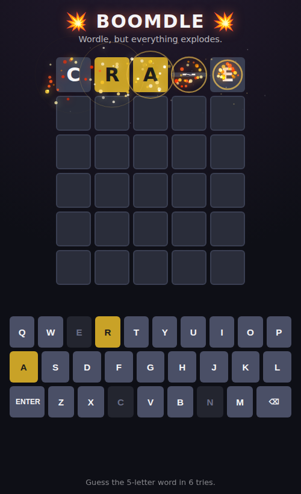

# 💥 Boomdle

A **Wordle clone with way more explosions.** Same 5-letters-in-6-guesses rules
you know, but every keypress sparks, every revealed tile detonates, wrong
guesses shake the board, and a win sets off a full-screen fireworks show.



## How to play

Guess the hidden 5-letter word in 6 tries.

- **Green** — right letter, right spot.
- **Yellow** — right letter, wrong spot.
- **Gray** — letter not in the word.

Type on your physical keyboard or click the on-screen keys. Press **Enter**
to submit, **⌫** to delete.

## The explosions

- **Sparks** puff off every letter you type.
- **Tile detonations** — each tile bursts with a state-themed particle blast
  and shockwave ring as it flips and locks in.
- **Screen shake** on every submitted guess (and a bigger one on win/lose).
- **Mega-boom** — winning triggers staggered multi-origin fireworks.
- **Shake + rejection wobble** when a guess isn't a real word.

All effects are drawn on a single full-screen `<canvas>` particle engine
(`explosions.js`) with additive blending for that glowy-fire look.

## Game feel

Built to feel fluid, snappy, and hard to put down:

- **Type-ahead** — reveals never block you. Because scoring is synchronous,
  the next row goes live the instant you submit, so you can keep typing while
  the previous row is still flipping. A queued Enter fires when it lands.
- **Fast reveals (~680ms)** with punchy, staggered flips.
- **Synthesized sound** (`sound.js`, Web Audio, zero assets) — key ticks,
  pitched flip tones that rise across the row, win fanfare, error buzz.
  On by default with a 🔊 mute toggle.
- **Haptics** on mobile (`navigator.vibrate`) for keys, hits, wins, errors.
- **Micro-interactions** — pulsing cursor on the active tile, key-press flash,
  floating `+points` popups, an animated score counter.
- **Targeted shake** — errors wobble the row, only wins/losses shake the
  screen (no more full-page shake every turn). Respects
  `prefers-reduced-motion`.

## Score, streaks & sharing

- **Score** — points per solve scale with fewer guesses, faster times, and a
  win-streak bonus; the running total persists in `localStorage`.
- **Endless loop** — an instant **Next word →** button keeps the run going;
  the 🔥 streak in the HUD is your reason not to stop.
- **📊 Statistics** — games played, win %, current & max streak, guess
  distribution (via the 📊 button).
- **🔗 Share** — copies the classic emoji result grid (🟩🟨⬛) plus your score.
- **🌙 / ☀️ theme** and **📱 responsive** layout, both remembered between
  sessions.

## Word packs

Pick a pack from the chips under the HUD (remembered between sessions):

| Pack | Words | What's in it |
| --- | --- | --- |
| 🌎 All Words | ~840 | Everything below, combined |
| 📖 Classic | ~770 | Common everyday 5-letter words |
| 😎 Gen Z | ~40 | Slang — `based`, `vibes`, `sigma`, `gyatt`, `slaps`… |
| 🌶️ Vulgar 🔞 | ~38 | Rude/NSFW words — a bleep-word mode |

Any real word from any pack is always accepted as a *guess*; only the hidden
answer is drawn from the selected pack. Word lists live in `words.js` as
`CATEGORIES`, so adding a new pack is a one-object change.

## Run it

It's pure static HTML/CSS/JS — no build step, no dependencies.

```bash
# just open the file
open index.html          # macOS
xdg-open index.html      # Linux

# ...or serve it (any static server works)
python3 -m http.server 8000
# then visit http://localhost:8000
```

## Project layout

| File | Purpose |
| --- | --- |
| `index.html` | Page structure and script includes. |
| `style.css` | Board, keyboard, and all CSS animations (shake, flip, pop). |
| `words.js` | `ANSWERS` (solution pool) and `VALID` (accepted guesses). |
| `explosions.js` | Canvas particle / shockwave / fireworks engine. |
| `script.js` | Game state, input handling, and Wordle scoring. |

## License

MIT — do whatever you like. Go make things explode.
